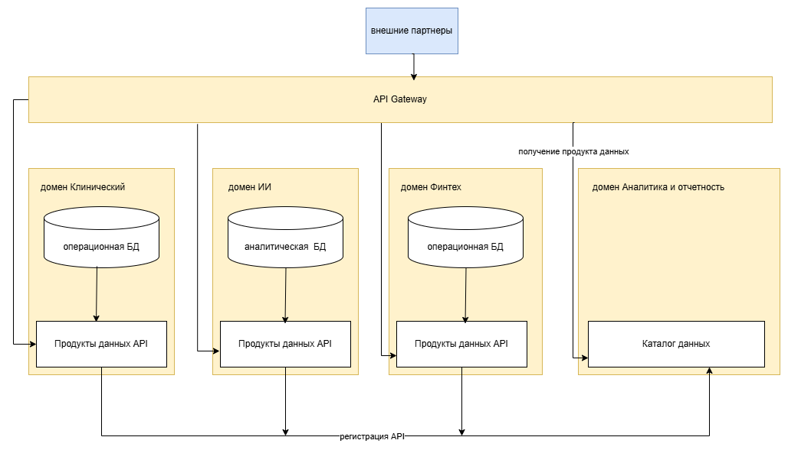

# Разделение системы на домены и моделирование потоков данных

## 1. Целевое разделение на домены

Разделяю четыре домена, каждый из которых полностью владеет своими данными и может развиваться независимо. 

---

### Домен 1. Клинический (Clinical)

**Назначение:** охватывает все операционные процессы клиник — от приёма пациентов до ведения медицинской документации.

**Данные под управлением домена:**
- Медицинские карты и истории болезни
- Результаты диагностических исследований 
- Данные по клиникам
- Данные по персоналу клиник 
- Расписание приёмов и загрузка кабинетов

**Ключевые бизнес-сценарии:**
- Приём и диагностика пациента врачом
- Назначение лечения
- Управление загрузкой клиник
- Формирование отчётности для Минздрава
- Инвентаризация оборудования и расходных материалов

**Почему выделен в отдельный домен:**
- Медицинские данные — наиболее чувствительные с точки зрения регулирования. Их хранение и обработка должны быть полностью изолированы от финтеха и партнёров.
- Врачам нужна максимальная производительность интерфейса — никакой конкуренции с аналитическими запросами.
- Данные имеют принципиально иной жизненный цикл и структуру, нежели финансовые или аналитические.

---

### Домен 2. Финтех (Fintech)

**Назначение:** предоставление финансовых услуг клиентам экосистемы, включая кредитование, ведение счетов и платёжные сервисы.

**Данные под управлением домена:**
- Финансовая история клиентов
- Счета и транзакции
- Данные о кредитах
- Платёжные операции
- Финансовая отчётность

**Ключевые бизнес-сценарии:**
- Выдача и сопровождение кредитов
- Проведение платежей
- Формирование отчётности
- Запуск новых финансовых продуктов

**Почему выделен в отдельный домен:**
- Банковская лицензия накладывает жёсткие регуляторные требования, отличные от медицинских. Данные должны храниться в отдельном контуре.
- Финтех-команда должна выпускать продукты независимо от клиник — нельзя блокировать запуск кредитной карты из-за изменений в медсистеме.
- Разные пики нагрузки: финансовые операции — непрерывный поток, в то время как клиники имеют дневной профиль.

---

### Домен 3. ИИ-сервисы (AI Services)

**Назначение:** разработка, обучение и эксплуатация моделей искусственного интеллекта для диагностики и поддержки врачебных решений.

**Данные под управлением домена:**
- Обезличенные датасеты для обучения моделей
- Сами модели
- Логи работы моделей и обратная связь от врачей
- Результаты обработки исследований ИИ-алгоритмами

**Ключевые бизнес-сценарии:**
- Обучение новых диагностических моделей на обезличенных данных
- Обработка медицинских снимков в real-time
- Мониторинг точности и деградации моделей
- Предоставление ИИ-подсказок врачу при постановке диагноза
- Коммерциализация ИИ-сервисов для внешних клиник

**Почему выделен в отдельный домен:**
- Команда data scientists работает в собственном ритме, несовместимом с операционными циклами клиник.
- Модели требуют специализированной инфраструктуры (GPU, MLOps), не нужной другим доменам.
- Возможна монетизация ИИ-сервисов как отдельного продукта для внешнего рынка — нужна архитектурная независимость.

---

### Домен 4. Аналитика и отчётность (Analytics & Data Products)

**Назначение:** предоставление бизнес-пользователям из всех подразделений инструментов самообслуживания для построения отчётов и аналитики.

**Данные под управлением домена:**
- Каталог продуктов данных
- Политики доступа и аудит использования данных
- Пользовательские настройки отчётов и дашбордов
- Агрегированные метрики по всей экосистеме

**Ключевые бизнес-сценарии:**
- Построение управленческой отчётности по всем направлениям
- Кросс-доменная аналитика (например, корреляция медицинских и финансовых показателей)
- Конструирование отчётов бизнес-пользователями
- Аудит доступа к данным

**Почему выделен в отдельный домен:**
- Это домен-агрегатор, который не владеет исходными данными, а потребляет продукты данных от других доменов.
- Централизует каталог и управление доступом, не вмешиваясь в логику доменов-владельцев.
- Позволяет бизнес-пользователям работать с данными, не имея прямого доступа к операционным системам.

---

### Принципы взаимодействия

- Все межмоменные взаимодействия — **асинхронные**, через события и API, без прямого доступа к базам данных других доменов.
- Критичные медицинские данные **никогда не покидают** клинический домен в сыром виде. Передаются только обезличенные и агрегированные срезы.
- Каждый домен публикует **продукты данных** через стандартизованные API, регистрируя их в общем каталоге.

### Ключевые сценарии взаимодействия

- **Врач ставит диагноз с ИИ-подсказкой:** клинический домен отправляет обезличенный снимок в ИИ-домен, получает результат. Финтех не затронут. DWH не участвует.
- **Запуск кредитного продукта:** финтех-команда меняет модели скоринга внутри своего домена. Клинический и ИИ-домены не требуют согласования.
- **Подключение фармкомпании:** клинический домен публикует продукт данных с обезличенной статистикой. Партнёр получает доступ через Gateway. Core-системы не затронуты.
- **Управленческая отчётность:** бизнес-пользователь через портал Аналитики запрашивает срезы. Портал собирает данные через API доменов. Никаких прямых запросов в операционные БД.

---

## Обеспечение интеграции новых бизнес-направлений без внесения бизнес-логики в DWH.

- **DWH как единое хранилище упразднён.** Логика распределена по доменам, каждый владеет своими данными и API.
- **Новый партнёр подключается** через получение доступа к продуктам данных нужного домена (через Gateway и каталог). Изменений в других доменах не требуется.
- **Новый домен** создаётся только если появляется уникальная бизнес-логика и данные, которыми не владеют существующие домены.

## Data flow диаграмма

# Преимущества доменной архитектуры для бизнеса

## 1. Ускорение вывода продуктов

**Сейчас:** запуск кредитного продукта требует изменений в общем DWH, согласования с клиниками и ожидания релизного окна.

**С доменами:** финтех-команда меняет только своё хранилище, деплоит независимо, публикует API в каталог. Конкуренты не успевают среагировать.

---

## 2. Снижение зависимости от DWH

**Сейчас:** DWH — бутылочное горлышко. Тяжёлый отчёт «вешает» интерфейс врача. Любое изменение требует очереди к DWH-команде.

**С доменами:** единого DWH нет. Клиники — Aurora, финтех — Greenplum, ИИ — PostgreSQL, аналитика — ClickHouse. Каждая БД оптимизирована под свою нагрузку. Никакой конкуренции за ресурсы, никакой очереди на изменения.

---

## 3. Независимое развитие направлений

**Сейчас:** приоритет клиник всегда выше. ИИ не может получить GPU — «у клиник другая потребность». Бюджет и бэклог общие.

**С доменами:** у каждого домена — своя команда, бюджет, дорожная карта и архитектурная автономия. Финтех растёт как финтех, ИИ — как AI-компания, клиники — как медицинский бизнес. Один не блокирует другой.

---

## 4. Подключение партнёров без изменений в core-системах

**Сейчас:** новый партнёр требует правок в DWH и согласования со всеми командами.

**С доменами:** клинический домен публикует партнёрскую витрину с обезличенной статистикой. Партнёр получает доступ через Gateway. Остальные домены не затронуты.