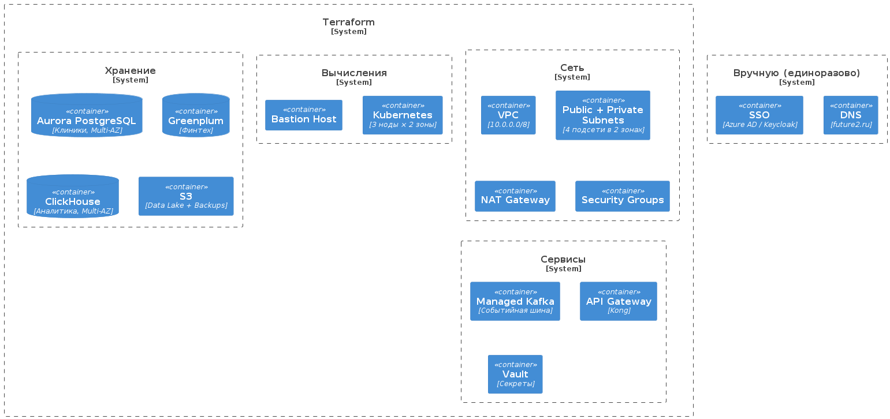
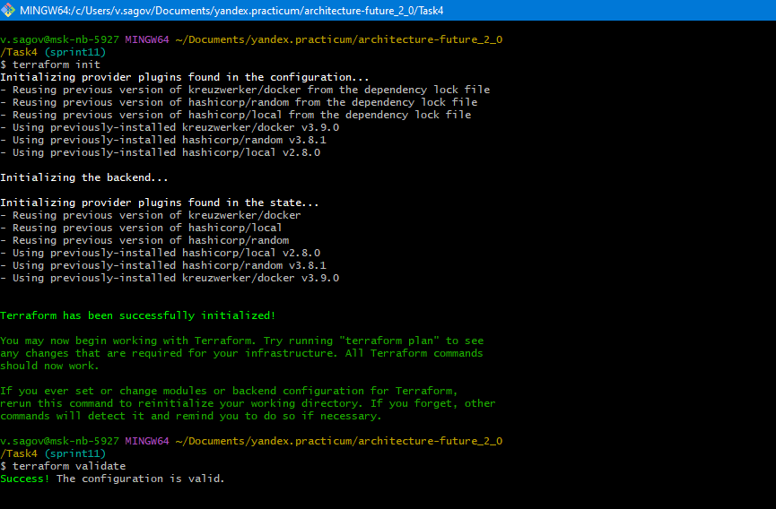
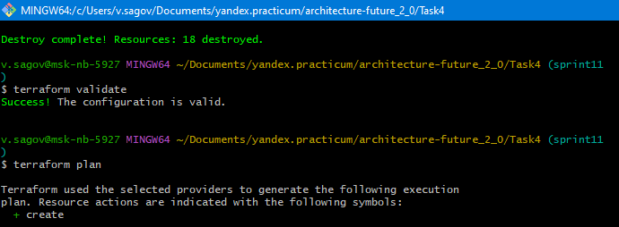
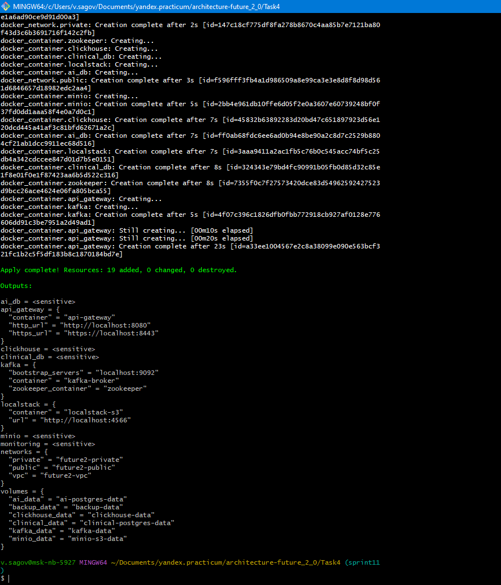

# Диаграмма автоматизации развёртывания

cd Task4

terraform init

terraform validate

terraform plan

#  Применить конфигурацию
terraform apply -auto-approve

# Обоснование конфигурации инфраструктуры

### Декларативный стиль Terraform

Конфигурация описывает **желаемое состояние** инфраструктуры, а не последовательность шагов по её созданию. Разработчик указывает **что** должно быть (VPC с заданным CIDR, Kubernetes-кластер с тремя нодами, базы данных с определёнными параметрами), а Terraform сам вычисляет **как** привести реальную инфраструктуру к этому состоянию.

**Ключевое преимущество:** даже если кто-то вручную изменил ресурс в облаке (например, удалил security group), повторный `terraform apply` восстановит конфигурацию до описанного состояния. Императивные скрипты так не умеют — они упадут с ошибкой «ресурс не найден».

### Воспроизводимость

- **Единый источник истины.** Вся инфраструктура описана в Git. Код — это и документация, и инструмент развёртывания одновременно. Новый инженер клонирует репозиторий, выполняет `terraform init && terraform apply` и получает точную копию production-окружения.
- **Атомарность изменений.** Каждый Pull Request содержит полный набор правок для одной задачи. Если что-то пошло не так — откатывается одним revert'ом.
- **Повторяемость между средами.** Один и тот же модуль разворачивает dev, staging и production. Различаются только значения переменных в `terraform.tfvars`. 

### Масштабируемость

- **Параметризация.** Количество нод Kubernetes, размер дисков, число реплик БД — всё вынесено в переменные. Чтобы масштабировать кластер, достаточно изменить число в `terraform.tfvars` и выполнить `terraform apply`.
- **Модульность.** Повторяющиеся компоненты (PostgreSQL-кластер, Kafka-топик) можно оформить как модули и переиспользовать. Новый домен (фармацевтика) создаётся вызовом готового модуля с другими параметрами.
- **Интеграция с CI/CD.** Инфраструктурные изменения проходят тот же пайплайн, что и код приложений: тестирование, code review, автоматическое применение. Это позволяет командам деплоить инфраструктуру так же часто, как и сервисы.

---

### Выбор конкретных образов и их параметров

| Компонент | Образ                                      | Обоснование |
|---|--------------------------------------------|---|
| **Клиническая БД** | `postgres:16-alpine`                       | Alpine-версия минимизирует размер образа  |
| **БД ИИ-сервисов** | `postgres:16-alpine`                       | Тот же образ для унификации. Отдельный контейнер обеспечивает изоляцию данных ИИ от клинических данных — требование compliance. |
| **ClickHouse** | `clickhouse/clickhouse-server:23.8-alpine` | Версия 23.8 — последняя стабильная на момент разработки. Alpine для минимизации размера. Оптимизирован под OLAP-запросы (аналитика). |
| **Zookeeper** | `confluentinc/cp-zookeeper:7.5.0`          | Необходим для координации Kafka-кластера. Версия синхронизирована с версией Kafka от Confluent. |
| **Kafka** | `confluentinc/cp-kafka:7.5.0`              | Официальный образ от Confluent. Версия 7.5.0 включает все исправления безопасности и поддерживает KRaft (режим без Zookeeper) для будущей миграции. |
| **MinIO** | `minio/minio:latest`                       | Полностью совместим с Amazon S3 API. Имитирует S3 Data Lake для хранения обезличенных данных и бэкапов. Имеет встроенную консоль управления. |
| **API Gateway** | `nginx:alpine`                             | Лёгкий reverse proxy . Имитирует Kong/APIM, маршрутизируя запросы к сервисам. В production заменяется на Kong без изменения архитектуры взаимодействия. |
| **Prometheus** | `prom/prometheus:latest`                   | Сбор метрик со всех сервисов. Хранение временных рядов оптимизировано для мониторинга. |
| **Grafana** | `grafana/grafana:latest`                   | Визуализация метрик из Prometheus. Позволяет создавать дашборды для отслеживания состояния инфраструктуры. |

---

##  Обоснование сетевой архитектуры

### Три изолированные сети

**Почему три сети, а не одна:**

- **Принцип наименьших привилегий.** Базы данных и Kafka находятся в приватной сети (`internal = true`) — они недоступны извне и не имеют доступа в интернет. Это защищает чувствительные данные от атак.
- **Контролируемый вход.** Единственная точка входа извне — API Gateway в публичной сети. Весь трафик проходит через него, что позволяет централизованно применять политики аутентификации и аудита.
- **Соответствие compliance.** Изоляция медицинских данных в приватной сети — требование ФЗ-152 и отраслевых стандартов.

---

##  Обоснование параметров безопасности

### Пароли и секреты

Все пароли вынесены в переменные с флагом `sensitive = true`. Это означает, что Terraform:
- Не выводит их в консоль при выполнении `terraform plan` и `terraform apply`.
- Не записывает их в state-файл в открытом виде (при использовании удалённого backend с шифрованием).
- Требует явного указания через `terraform.tfvars` или переменные окружения.

**Рекомендация для production:** заменить хранение паролей в `terraform.tfvars` на интеграцию с HashiCorp Vault или облачным KMS.

### Принцип наименьших привилегий

- **Сервисные аккаунты** создаются отдельно для Kubernetes и приложений. У каждого — минимально необходимые роли.
- **Приватная сеть** изолирует базы данных от внешнего мира. Даже если хост скомпрометирован, злоумышленник не получит прямого доступа к данным.
- **Security Groups** (в Docker-конфигурации — сетевые правила) разрешают только необходимые порты и протоколы.

---

p/s 

##  Обоснование выбора Docker-провайдера и образов

Конфигурация использует `kreuzwerker/docker` вместо `yandex-cloud/yandex` по следующей причине:

- **Локальная воспроизводимость.** Экономия времени. Докер используется только в качестве учебного примера. Для **prod** окружений рекомендовано использовать облако.
